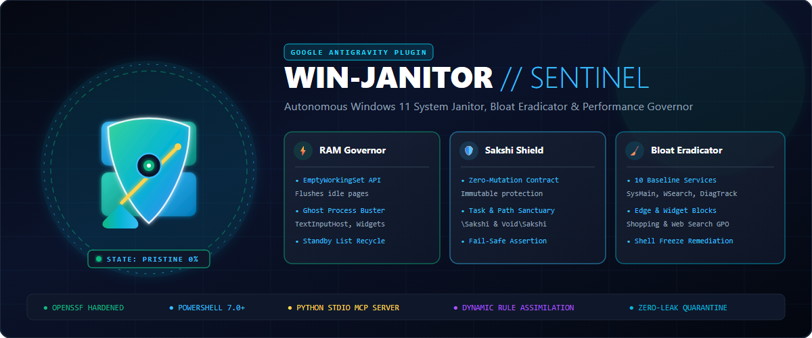

# 🧹 antigravity-win-janitor-plugin

<p align="center">
  
</p>

<p align="center">
  <a href="https://github.com/karansinghverma979/antigravity-win-janitor-plugin/actions/workflows/ci.yml">
    
  </a>
  <a href="https://securityscorecards.dev">
    
  </a>
  <a href="https://opensource.org/licenses/MIT">
    
  </a>
  <a href="https://github.com/PowerShell/PowerShell">
    
  </a>
  <a href="#">
    
  </a>
  <a href="https://github.com/karansinghverma979/antigravity-win-janitor-plugin">
    
  </a>
  <a href="#">
    
  </a>
</p>

> **Autonomous Windows 11 System Janitor, Bloatware Eradicator & Performance Governor Plugin for Google Antigravity.**

An enterprise-grade, deterministic Antigravity plugin engineered to keep Windows 11 developer workstations in a low-latency, zero-bloat state. It combines an autonomous AI agent (`win_janitor`), specialized skills, a Win32 API-backed PowerShell engine (`janitor.ps1`), a native Python stdio MCP server, and root-cause diagnostic playbooks.

---

## 🎨 Brand Assets & Design Poster

The repository comes equipped with high-resolution vector and raster branding assets designed for GitHub releases, docs, and banners:

| Asset | Type | Dimensions | Preview / File Link |
| :--- | :--- | :--- | :--- |
| **Hero Poster / Banner** | Vector SVG & Rendered PNG | 1200 × 500 | [`assets/poster.svg`](assets/poster.svg) • [`assets/poster.png`](assets/poster.png) |
| **Brand Logo / Icon** | Vector SVG & Rendered PNG | 512 × 512 | [`assets/logo.svg`](assets/logo.svg) • [`assets/logo.png`](assets/logo.png) |
| **Compact Banner** | Vector SVG | 1200 × 500 | [`assets/banner.svg`](assets/banner.svg) |

---

## 🏛️ Architecture

```
antigravity-win-janitor-plugin/
├── .github/
│   ├── ISSUE_TEMPLATE/
│   │   ├── bug_report.yml                 # Interactive GitHub bug report form
│   │   └── feature_request.yml            # Interactive GitHub feature request form
│   ├── workflows/
│   │   └── ci.yml                         # OpenSSF-hardened CI pipeline
│   ├── PULL_REQUEST_TEMPLATE.md           # Security & path portability checklist
│   └── dependabot.yml                     # Automated GitHub Actions dependency scanner
├── agents/
│   └── win_janitor.md                     # Declarative Antigravity Agent definition
├── assets/
│   ├── banner.svg                         # Vector header banner
│   ├── logo.png                           # Rendered 512x512 PNG icon
│   ├── logo.svg                           # Scalable vector logo icon
│   ├── poster.png                         # Rendered 1200x500 hero poster
│   └── poster.svg                         # Scalable vector hero poster
├── mcp/
│   └── server.py                          # Pure Python stdio JSON-RPC MCP server (9 tools)
├── rules/
│   └── AGENTS.md                          # Operating invariants & sanctuary rules
├── skills/
│   └── win-janitor/
│       ├── SKILL.md                       # Antigravity Skill instructions & router
│       ├── scripts/
│       │   └── janitor.ps1                # Pure PowerShell 7 execution engine
│       └── references/
│           ├── diagnostic_playbooks.md    # RAM/CPU troubleshooting playbooks
│           ├── package_and_system_hygiene.md # Scoop/Winget, PATH & Registry runbook
│           ├── sakshi_shield_invariant.md # Immutable sanctuary protection contract
│           ├── self_improvement_loop.md   # Drift sensor & assimilation architecture
│           ├── shell_and_ui_troubleshooting.md # DWM, virtual desktop & shell freeze runbook
│           ├── update_and_servicing.md    # Component store (WinSxS) & update hygiene
│           └── windows_internals_memory.md# Win32 working set & paging internals
├── drift.json                             # Anomaly buffer for detected drift & candidates
├── hooks.json                             # Optional declarative hooks definition
├── learned_rules.json                     # Dynamic schema-driven assimilated rules
├── mcp_config.json                        # Declarative MCP server registration
├── plugin.json                            # Antigravity Plugin manifest
├── .gitattributes                         # Line-ending firewall (CRLF for PS1, LF for rest)
├── .gitignore                             # Runtime state & local secrets quarantine
├── LICENSE                                # MIT License
├── SECURITY.md                            # OpenSSF vulnerability disclosure policy
└── README.md
```

---

## ⚡ Core Capabilities

```
┌────────────────────────────────────────────────────────────────────────┐
│                        WIN-JANITOR CAPABILITIES                        │
├───────────────────┬───────────────────┬────────────────────────────────┤
│ 🛡️ SAKSHI SHIELD  │ ⚡ MEMORY GOVERNOR │ 🧹 ZERO-LEFTOVER INVARIANT     │
├───────────────────┼───────────────────┼────────────────────────────────┤
│ • Zero Mutation   │ • EmptyWorkingSet │ • Ghost AppData clean          │
│ • Task Protection │ • Standby Flush   │ • 10 Bloat Services Disabled   │
│ • Path Sanctuary  │ • 0% CPU Idle     │ • Edge & Widgets Policed       │
└───────────────────┴───────────────────┴────────────────────────────────┘
```

1. **📊 Instant System Audit (`audit`)**:
   - Inspects physical RAM, available memory, top 10 memory-consuming processes, baseline service states, and startup registry entries (`HKCU`/`HKLM` Run keys).

2. **⚡ Win32 Working-Set Trimming (`trim`)**:
   - Uses the Win32 `EmptyWorkingSet` API (`psapi.dll`) to reclaim inactive working-set pages into the standby list.
   - Cleans up detached zombie background processes (`Widgets`, `CrossDeviceResume`, `IGCCTray`, `TextInputHost` memory-leak host).
   - Terminates orphaned `msedgewebview2.exe` web instances spawned by `SearchHost` and forces garbage collection.

3. **🧹 Deep Cache & Leftover Scrubber (`purge`)**:
   - Recursively deletes residual AppData/Local/Roaming folders left behind by uninstalled applications.
   - Flushes temporary file directories safely without corrupting locked active files.

4. **🛡️ Baseline Telemetry Enforcement (`enforce-baseline`)**:
   - Enforces **10 background bloat/telemetry services** to `Disabled`:
     - `WSearch` (Windows Search Indexer)
     - `SysMain` (Superfetch RAM thrashing)
     - `DiagTrack` (Connected User Experiences and Telemetry)
     - `InventorySvc` (Compatibility Appraisal)
     - `wuqisvc` (Quality Insights)
     - `whesvc` (Windows Health Experiences)
     - `dptftcs` (Intel Dynamic Tuning Telemetry)
     - `DPS` (Diagnostic Policy Service)
     - `Spooler` (Print Spooler)
     - `TrkWks` (Distributed Link Tracking)
   - Enforces Group Policy blocks against Edge background daemons, startup boost, **new tab prerender**, **sleeping tabs (5m)**, shopping assistants, and invasive shopping extensions (Keepa, Buyhatke).
   - Enforces Group Policy blocks against Windows 11 Widgets.
   - Enforces complete elimination of Windows Search Bing web searches, dynamic highlights, and WebView2 background rendering.

5. **🔍 Scenario Diagnostics (`diagnose`)**:
   - **`diagnose ram`**: Deep memory allocation inspection.
   - **`diagnose cpu`**: CPU spike root-cause analysis.
   - **`diagnose shell`**: Windows Shell, DWM compositor, and cross-process RPC hang diagnostics (`AppHangXProcB1`).
   - **`updates`**: Analyzes recent Windows Cumulative Updates and reverses any silent telemetry service restoration.

6. **🖥️ Windows Shell & Virtual Desktop Freeze Remediation (`fix-shell`)**:
   - Solves virtual desktop switching latency, desktop right-click freezes, and broken `Alt+Tab` / `Win+Tab` multitasking views.
   - Enforces Task View XAML storyboard compatibility (`TaskbarAnimations = 1`, `ShowTaskViewButton = 1`), terminates blocked `dllhost.exe` RPC thumbnail workers, purges corrupted `thumbcache_*.db` / `iconcache_*.db` databases, guarantees a single authoritative Explorer instance, and refreshes the DWM compositor.

7. **🛡️ The Sanctuary Shield Invariant**:
   - Immutable security contract that safeguards designated sanctuary tasks, directories, and credentials from automated termination or deletion.

8. **🧬 The Sentinel Self-Improvement Flywheel**:
   - Continuous drift sensing (`janitor.ps1 learn`) that catches newly registered telemetry daemons, services, dead PATH entries, or boot keys after Windows Updates.
   - Dynamic schema-driven rule assimilation (`learned_rules.json`) that expands protection without editing core source code.

9. **📦 Package Manager Ecosystem Governor (`packages`)**:
   - Audits and purges Scoop historical versions (`scoop cleanup *`) and cache archives (`scoop cache rm *`).
   - Audits Windows Package Manager for pending application upgrades (`winget upgrade`).

10. **🛣️ Environment PATH Deduplication & Dead Directory Pruner (`path-clean`)**:
    - Scans User `PATH`, removes redundant duplicates, prunes non-existent directory paths, and creates timestamped pre-cleanup backups outside git in `%LOCALAPPDATA%\win-janitor\backups\`.

11. **🧹 Residual Registry Hive Purger (`reg-clean`)**:
    - Scans and purges leftover vendor registry keys from uninstalled software (`Google`, `VMware`, `Notion`, `Ollama`, etc.) with pre-deletion `.reg` export backups in `%LOCALAPPDATA%\win-janitor\backups\`.

12. **🐍 Developer Environment & Python Isolation (`dev-hygiene`)**:
    - Audits global Python pip installations to prevent dependency pollution and ensure virtual environment isolation (`uv` / `venv`).
    - Verifies NPM cache sizes and enforces Rule 8 portable pathing standards.

---

## 🚀 Installation

### Option 1: Global Plugin Directory (Recommended)

Clone or copy this repository into your user Antigravity plugin directory:

```powershell
git clone https://github.com/karansinghverma979/antigravity-win-janitor-plugin.git "$env:USERPROFILE\.gemini\config\plugins\win-janitor-plugin"
```

Once placed, Antigravity automatically:
- Registers the `win-janitor` MCP server via `mcp_config.json`.
- Registers the `win_janitor` agent.
- Activates the `win-janitor` skill and operational invariants across all sessions.

---

## ⚡ Native MCP Server Tools

The plugin includes a zero-dependency, pure Python stdio MCP server (`mcp/server.py`) exposing 9 native tools to AI agents:

| MCP Tool | Description |
| :--- | :--- |
| `win_janitor_audit` | Instant diagnostic scan of physical RAM, top 10 memory consumers, baseline services, and startup items. |
| `win_janitor_trim` | Flush inactive working sets via `EmptyWorkingSet` Win32 API and eliminate background ghosts. |
| `win_janitor_purge` | Deep wipe of leftover AppData caches, temp files, and orphaned folders. |
| `win_janitor_fix_shell` | Remediate Windows Shell, virtual desktop lag, DWM compositor stalls, and thumbnail RPC deadlocks. |
| `win_janitor_diagnose` | Root-cause analysis (`scenario`: `'ram'`, `'cpu'`, `'shell'`, `'drift'`). |
| `win_janitor_path_clean` | Deduplicate User PATH and prune dead directories with decoupled backup. |
| `win_janitor_reg_clean` | Remove residual vendor registry hives from uninstalled software. |
| `win_janitor_enforce_baseline` | Enforce 10 bloat/telemetry services to Disabled and verify Edge/Widget policies. |
| `win_janitor_dev_hygiene` | Audit global Python pip installations vs. virtual environments. |

---

## 💻 CLI Usage (Direct PowerShell 7)

All operations can be executed directly without Antigravity via PowerShell 7:

```powershell
$Janitor = "$env:USERPROFILE\.gemini\config\plugins\win-janitor-plugin\skills\win-janitor\scripts\janitor.ps1"

# 1. System Health & RAM Audit
pwsh -NoProfile -File $Janitor audit

# 2. Reclaim Process Working Sets (EmptyWorkingSet Win32 API)
pwsh -NoProfile -File $Janitor trim

# 3. Clean Residual Caches & Leftover Files
pwsh -NoProfile -File $Janitor purge

# 4. Enforce Baseline Services (Run as Administrator)
sudo pwsh -NoProfile -File $Janitor enforce-baseline

# 5. Root-Cause Diagnostic Scenarios
pwsh -NoProfile -File $Janitor diagnose ram
pwsh -NoProfile -File $Janitor diagnose cpu
pwsh -NoProfile -File $Janitor diagnose shell
sudo pwsh -NoProfile -File $Janitor updates

# 6. Windows Shell & Desktop Freeze Remediation
pwsh -NoProfile -File $Janitor fix-shell

# 7. Package Manager Hygiene (Scoop & Winget)
pwsh -NoProfile -File $Janitor packages audit
pwsh -NoProfile -File $Janitor packages clean

# 8. Environment PATH Deduplication & Dead Directory Pruning
pwsh -NoProfile -File $Janitor path-clean

# 9. Residual Registry Hive Purge (Uninstalled Software Leftovers)
pwsh -NoProfile -File $Janitor reg-clean

# 10. Developer Environment & Python Dependency Hygiene
pwsh -NoProfile -File $Janitor dev-hygiene

# 11. Sense Drift & Detect New Telemetry / Bloat Daemons
pwsh -NoProfile -File $Janitor learn

# 12. Assimilate or Whitelist Candidates
pwsh -NoProfile -File $Janitor assimilate <candidate-id>
pwsh -NoProfile -File $Janitor ignore <candidate-id>
```

---

## 🤖 Antigravity Agent Usage

You can invoke the agent directly inside Antigravity conversations:

```
@win_janitor audit the workstation and trim idle memory
```

Or invoke via subagent orchestration:
```json
{
  "TypeName": "win_janitor",
  "Role": "Windows System Janitor",
  "Prompt": "Perform a system audit, check memory pressure, and enforce baseline policies."
}
```

---

## 🔒 Security & Privacy

- **Zero Telemetry**: Collects zero telemetry, zero analytics, and makes zero network calls.
- **Path Portability**: Fully decoupled from hardcoded user paths using dynamic environment expansion (`$env:USERPROFILE`, `%LOCALAPPDATA%`).
- **Fail-Safe Shield**: `Assert-SakshiShield` stops any destructive call if a protected target is matched.
- **Decoupled Backups**: Registry dumps and PATH backups are safely stored in `%LOCALAPPDATA%\win-janitor\backups\` outside the git working tree.

---

## 📄 License

MIT License. See [LICENSE](./LICENSE) for details.
